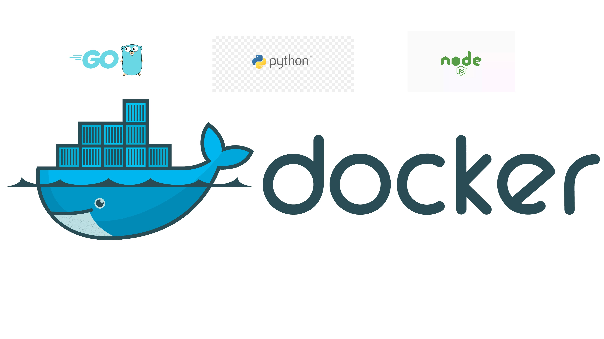
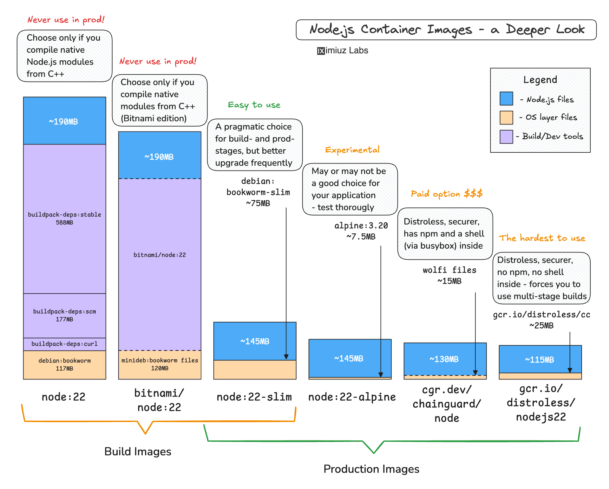

# About

This project provides highly optimized, minimal Docker container images for popular languages (Python, Go, Node.js), focusing on size, security, and runtime efficiency. We leverage a suite of tools to achieve these goals:

* **Image Minification:** [MinToolkit](https://github.com/mintoolkit/mint) for significant size reduction.
* **Vulnerability Scanning:** [Trivy](https://github.com/aquasecurity/trivy) for comprehensive security assessments.
* **Software Bill of Materials (SBOM) Generation:** [Syft](https://github.com/anchore/syft) for detailed component tracking.
* **Image Analysis:** [Dive](https://github.com/wagoodman/dive) for interactive layer inspection and efficiency checks.
* **Image Diffing:** [diffoci](https://github.com/reproducible-containers/diffoci) for detailed comparisons between images.

These tools enable us to create lean, secure, and efficient container images, reducing resource consumption and minimizing potential attack vectors.

**Key Benefits:**

* **Reduced Image Size:** Achieve substantial size reductions through minification.
* **Enhanced Security:** Identify and mitigate vulnerabilities with thorough security scans.
* **Improved Runtime Efficiency:** Eliminate unnecessary components for faster execution.
* **Transparent Component Tracking:** Generate SBOMs for complete visibility into image contents.
* **Detailed Image Analysis:** Understand image composition and optimize for efficiency.

# Requirements
- [Docker](https://www.docker.com/products/docker-desktop/) (Latest version)

# Optimized Images
Explore the monorepo to find optimized Docker images tailored for your specific language needs:
- [![Language: Go][Golang-logo]](./golang/)
- [![Language: Python][Python-logo]](./python/)
- [![Language: Node][Node-logo]](][./node/])

# References

## Dockerfile best practices
[Guide for writing production-worthy Docker images.](https://github.com/hexops-graveyard/dockerfile)
[Official Docker Guide for best practices to build images.](https://docs.docker.com/build/building/best-practices)
[Official Docker Multi-stage guide.](https://docs.docker.com/build/building/multi-stage)

## Docker Bench for Security
[A script that checks for dozens of common best-practices around deploying Docker containers in production.](https://github.com/docker/docker-bench-security)

## A Deeper Look into Node.js Docker Images
[Research to help you choose the right base image for your Node.js application.](https://labs.iximiuz.com/tutorials/how-to-choose-nodejs-container-image)

<!-- MARKDOWN LINKS & IMAGES -->
<!-- https://github.com/alexandresanlim/Badges4-README.md-Profile -->
[Golang-logo]: https://img.shields.io/badge/language-Go-00ADD8?style=for-the-badge&logo=go&logoColor=blue
[Python-logo]: https://img.shields.io/badge/language-Python-FFD43B?style=for-the-badge&logo=python&logoColor=blue
[Node-logo]: https://img.shields.io/badge/language-Node%20js-339933?style=for-the-badge&logo=nodedotjs&logoColor=blue