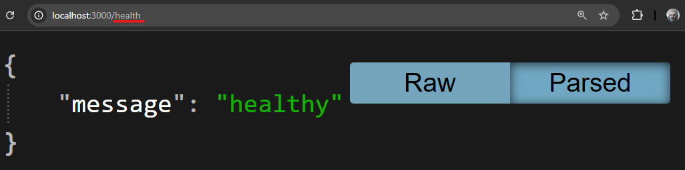
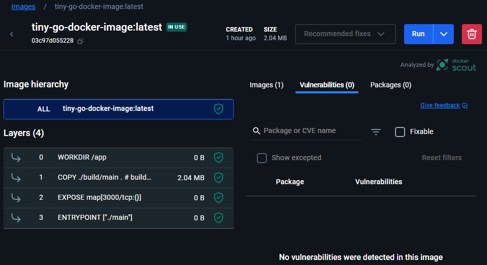
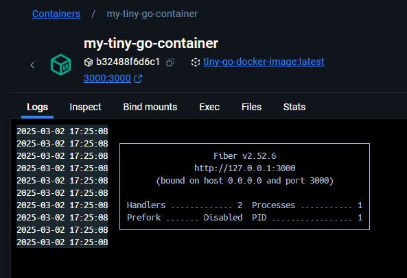
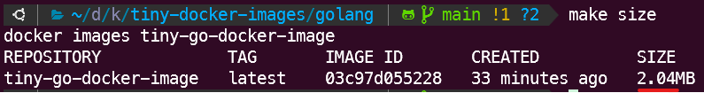
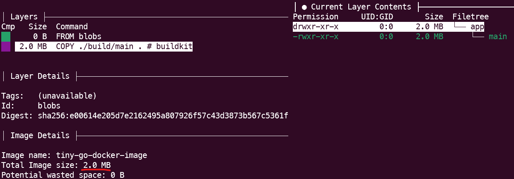
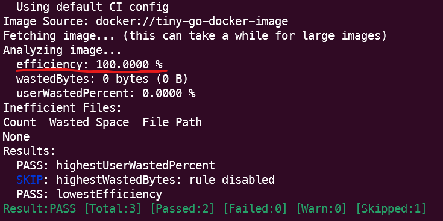
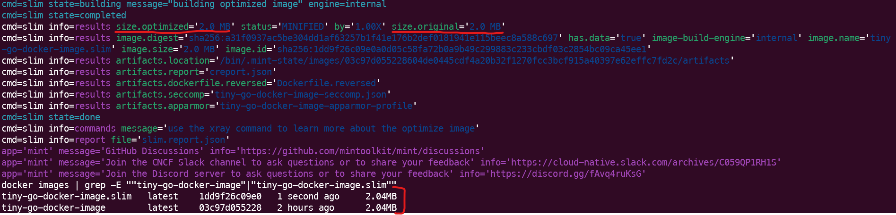
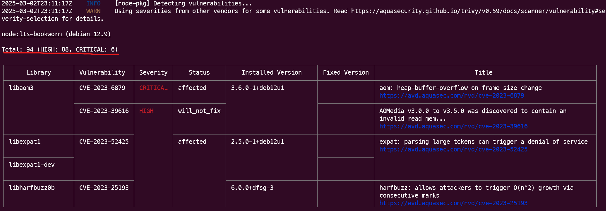
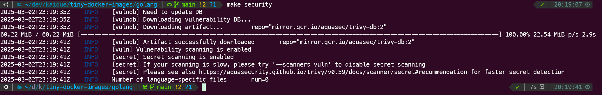

## About the application
This Golang application implements a simple health check endpoint (`/health`) using the [GoFiber web framework](https://github.com/gofiber/fiber). Upon receiving a GET request, it returns an HTTP 200 status code with a JSON response: `{"message": "healthy"}`.



## About the Docker image
A tiny **2MB**, statically linked Go image. Secure, [UPX-compressed](https://github.com/upx/upx), and running in a [scratch](https://hub.docker.com/_/scratch) (distroless) environment.



## Usage
### Build the image and run the container
```bash
make up
```


### Acess the health endpoint
[http://localhost:3000/health](http://localhost:3000/health)


### Show the Docker image size
```bash
make size
```


### Inspect each layer and files inside the Docker image using [Dive](https://github.com/wagoodman/dive) interactive UI
```bash
make inspect
```


### Check if the Docker image has an acceptable size and wasted space ratio using [Dive](https://github.com/wagoodman/dive) CI mode
```bash
make check
```


### Minify the Docker image using [MinToolkit](https://github.com/mintoolkit/mint) and compare sizes with the original image
```bash
make minify
```


> SlimToolkit's optimization process did not result in a size reduction. The image's minimal footprint (2MB) is achieved by using scratch (distroless) as the base and directly copying the statically linked Go binary from the builder stage, which already results in a highly optimized image.

### Security scan to find known vulnerabilities (CVEs) and sensitive information and secrets using [Trivy](https://github.com/aquasecurity/trivy)
```bash
make security
```


> A Trivy scan of the node:lts-bookworm (Debian 12.9) image revealed multiple vulnerabilities. In contrast, this project's Golang image, built using a distroless base with only the compiled Go binary, showed zero vulnerabilities as you can see in the print bellow.


