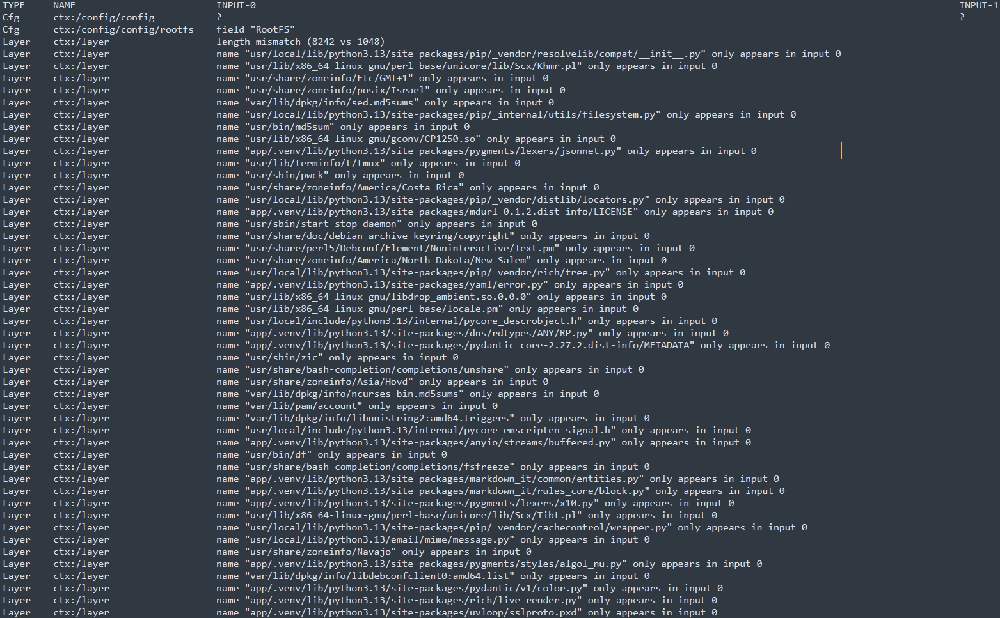
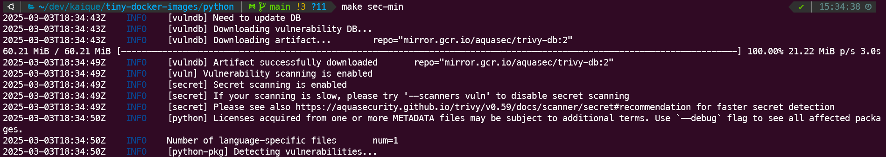

## About the application
This Python application implements a simple health check endpoint (`/health`) using the [FastAPI framework](https://github.com/fastapi/fastapi). Upon receiving a GET request, it returns an HTTP 200 status code with a JSON response: `{"message": "healthy"}`.


## About the base Docker image
A small **162MB** Python image, using [UV](https://github.com/astral-sh/uv) as the package manager, multi-stage build to decrease the final image size and running in a [python slim debian 12.9 official image](https://hub.docker.com/_/python).


## Usage

### Makefile Help

This project's Makefile provides a suite of commands to streamline Docker image management, including building, running, inspecting, analyzing, minifying, and checking for vulnerabilities.

To view a detailed list of available commands and their descriptions, run:

```bash
make help
```


### Build the image and run the container
```bash
make up
```


### Acess the health endpoint
[http://localhost:8000/health](http://localhost:8000/health)


### Show the Docker image size
```bash
make size
```


### Inspect each layer and files inside the Docker image using [Dive](https://github.com/wagoodman/dive) interactive UI
```bash
make inspect
```


### Check if the Docker image has an acceptable size and wasted space ratio using [Dive](https://github.com/wagoodman/dive) CI mode
```bash
make check
```


### Minify the Docker image using [MinToolkit](https://github.com/mintoolkit/mint) and compare sizes with the original image
```bash
make min
```


> SlimToolkit reduced the image size from 162MB to 66MB, a reduction of approximately 59%.

### Show the Docker image differences between the original vs minified version using [diffoci](https://github.com/reproducible-containers/diffoci)
#### Requirements
- [Golang 1.21 version or later](https://go.dev/doc/install)

#### Install the [diffoci](https://github.com/reproducible-containers/diffoci) as a global package using Go
```bash
make diff-install
```

#### Generate a text file, `diff-original-vs-minified-image.txt`, containing the differences between the original and minified Docker images [diffoci](https://github.com/reproducible-containers/diffoci)
```bash
make diff
```



### Security scan to the original image to find known vulnerabilities (CVEs) and sensitive information and secrets using [Trivy](https://github.com/aquasecurity/trivy)
```bash
make sec
```


> A Trivy scan of the tiny-python-docker-image (debian 12.9) base image revealed one critical (zlib OS dependency) and one high (perl OS dependency) vulnerability.

### Security scan to the minified image to find known vulnerabilities (CVEs) and sensitive information and secrets using [Trivy](https://github.com/aquasecurity/trivy)
```bash
make sec-min
```


> A Trivy scan of the tiny-python-docker-image.slim (debian 12.9) minified image showed zero vulnerabilities as you can see in the print above.

### Perform a software catalog scan to generate a Software Bill of Materials (SBOM) of the docker image, utilizing the [Syft](https://github.com/anchore/syft) tool

### SBOM of the base image
```bash
make sbom
```


### SBOM of the minified image
```bash
make sbom-min
```

> The minified image achieves a 96% reduction in resources compared to the base image, effectively eliminating unnecessary OS packages and binaries.

| Category      | Base Image        | Minified Image | Difference | Percentage Reduction |
|---------------|-------------------|----------------|------------|----------------------|
| Packages      | 141 packages      | 35 packages    | 106        | 75%                  |
| File Digests  | 3,273 files       | 82 files       | 3191       | 97%                  |
| Executables   | 804 executables   | 56 executables | 748        | 93%                  |
| **Total**     | 4,218             | 173            | **4,045**  | **96%**              |